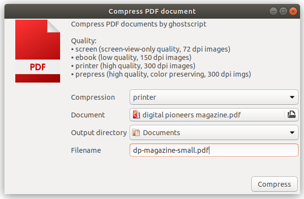

# PDF compress utility

A simple utility to compress PDF files, based on YAD and Ghostscript.



## Installation

### Linux (Appimage)

Download installation package of the [latest release](https://github.com/moonline/Utility.PdfCompress/releases).

#### Create application launcher

1. Copy AppImage file to `.local/bin/pdfcompress.AppImage` in your home directory.

```sh
cp pdfcompress-*.AppImage ~/.local/bin/pdfcompress.AppImage
```

2. Make it executable 

```sh
sudo chmod+x ~/.local/bin/pdfcompress.AppImageS
```

3. Copy the launcher `pdfcompress.desktop` to `.local/share/applications/`.

```sh
cp pdfcompress.desktop ~/.local/share/applications/
```


## Uninstall

Remove appimage and launcher:

```sh
rm ~/.local/share/applications/pdfcompress.desktop
rm ~/.local/bin/pdfcompress.AppImage
```


## Development

### Environment

* Install yad: `sudo apt install yad`
* Install ghostscript: `sudo apt install ghostscript`

### Start

```sh
chmod+x pdfcompress.sh
pdfcompress.sh
```


## Package

* Install `appimage-builder`: https://appimage-builder.readthedocs.io/en/latest/intro/install.html

### Build appimage on Ubuntu/Mint

```sh
appimage-builder --recipe appimage/appimage-amd64.yml
```

